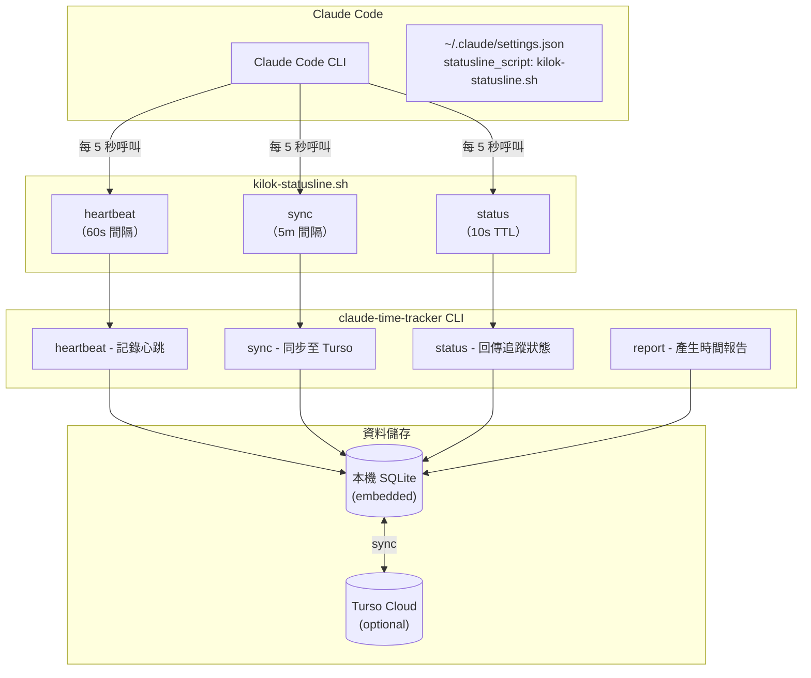

# Kilok - Claude Code Time Tracker

> **Kilok** 取自台語「記錄」（kì-lo̍k）的諧音，同時也是英文 **key log** 的組合。

## Project Overview

**Kilok** 是一個為 Claude Code 設計的時間追蹤工具，透過 statusline 整合自動記錄每個專案的工作時數。

### 核心特色

- **零侵入追蹤**：透過 Claude Code statusline hook 運作，無需任何手動操作
- **Work Item 追蹤**：自動從 git branch 提取 issue ID，聚合工作項目時間
- **Transcript 閒置偵測**：監控 Claude transcript 檔案的修改時間，精準判斷閒置狀態
- **計費工時計算**：自動計算（原始 × 1.2，0.5h 為單位進位），支援手動覆寫
- **月額度追蹤**：支援月結型合約，追蹤使用狀況與累計結轉
- **客戶分享連結**：Token-based 公開頁面，讓客戶查看唯讀報告
- **雲端同步（可選）**：支援 Turso embedded replica，多裝置同步
- **MCP Server**：提供 Claude Code 內建工具，方便查詢和管理追蹤資料
- **Web 儀表板**：SvelteKit 應用，支援客戶/專案/合約管理、工作項目編輯

---

## Directory Structure

```
.
├── apps/
│   └── web/                    # SvelteKit 儀表板
│       └── src/
│           ├── lib/
│           │   ├── components/     # 共用 UI 元件
│           │   │   ├── StatsCard.svelte
│           │   │   ├── QuotaProgressBar.svelte
│           │   │   ├── MonthlyChart.svelte
│           │   │   ├── PeriodNavigation.svelte
│           │   │   └── EmptyState.svelte
│           │   ├── utils/          # 共用工具函式
│           │   │   └── formatters.ts
│           │   └── server/
│           │       └── db.ts       # Turso 資料庫操作
│           └── routes/
│               ├── admin/          # 管理介面（需登入）
│               ├── share/          # 公開分享頁面
│               └── [clientSlug]/   # 客戶報告頁面
├── crates/
│   └── tracker/                # Rust CLI + MCP Server
│       └── src/
│           ├── main.rs         # CLI entry point
│           ├── mcp/            # MCP Server implementation
│           │   ├── main.rs     # MCP Server entry
│           │   └── db_wrapper.rs
│           ├── tracker.rs      # Core tracking logic
│           ├── db.rs           # SQLite/Turso database
│           ├── idle.rs         # Transcript-based idle detection
│           ├── billable.rs     # 計費工時計算
│           ├── statusline.rs   # Powerlevel10k-style statusline
│           └── weather.rs      # 天氣顯示（可選）
├── docs/
│   └── plans/                  # 設計文件
├── scripts/
│   └── install.sh              # 安裝腳本
└── skill/
    └── SKILL.md                # Claude Code slash command 定義
```

---

## Technical Architecture



---

## Data Flow

### Heartbeat 流程

1. Claude Code statusline 每 5 秒呼叫 wrapper script
2. Wrapper script 節流：每 60 秒才實際呼叫 `heartbeat` 命令
3. `heartbeat` 命令：
   - 讀取 transcript JSONL 檔案的 mtime
   - 比較與上次 heartbeat 的時間差
   - 若 mtime 有變動 → 使用者活躍，累加時間
   - 若 mtime 超過 idle_timeout → 標記為閒置

### Idle Detection（閒置偵測）

```
Transcript JSONL 檔案位置：
~/.claude/projects/{hash}/{session-id}.jsonl

偵測邏輯：
┌─────────────────────────────────────────────┐
│ last_transcript_mtime vs current_mtime      │
├─────────────────────────────────────────────┤
│ mtime 有變化 → 使用者正在輸入/Claude 回應   │
│ mtime 無變化超過 10 分鐘 → 閒置             │
└─────────────────────────────────────────────┘
```

### 報告產生流程（關鍵）

使用者產生報告時，**必須透過 `/kilok` skill**，而非直接使用 CLI。

```
┌──────────────────────────────────────────────────────────────────┐
│ 使用者：「/kilok 幫我統計這個月的時數」                          │
└─────────────────────────────┬────────────────────────────────────┘
                              │
                              ▼
┌──────────────────────────────────────────────────────────────────┐
│ Step 1: 透過 MCP 取得原始資料                                    │
│         list_work_items(month: "2026-01")                        │
└─────────────────────────────┬────────────────────────────────────┘
                              │
                              ▼
┌──────────────────────────────────────────────────────────────────┐
│ Step 2: Claude 處理資料                                          │
│   • 翻譯 work item ID → 中文標題                                 │
│     (invoice-enhancements → 發票功能強化)                        │
│   • 彙整 git commits → 中文描述                                  │
└─────────────────────────────┬────────────────────────────────────┘
                              │
                              ▼
┌──────────────────────────────────────────────────────────────────┐
│ Step 3: 透過 MCP 儲存翻譯後的資料（關鍵！）                      │
│         create_work_item(identifier, title, description)         │
│                                                                  │
│   ⚠️ 這一步會將翻譯後的標題和描述存入資料庫                       │
│      Web 端才能讀取到可讀的中文內容                              │
└─────────────────────────────┬────────────────────────────────────┘
                              │
                              ▼
┌──────────────────────────────────────────────────────────────────┐
│ Step 4: 輸出格式化報告給使用者                                   │
└──────────────────────────────────────────────────────────────────┘
```

**為什麼不能只用 CLI？**

| 方式 | 原始資料 | 翻譯標題 | Web 儀表板 |
|------|----------|----------|------------|
| `/kilok` skill | ✅ | ✅ 自動翻譯並儲存 | ✅ 有資料 |
| CLI 直接執行 | ✅ | ❌ 只有技術 ID | ❌ 無翻譯資料 |

---

## Development Commands

```bash
# Build
cargo build -p claude-time-tracker

# Run CLI
cargo run -p claude-time-tracker -- status
cargo run -p claude-time-tracker -- report --format json

# Run MCP Server (for testing)
cargo run -p claude-time-tracker --bin claude-time-tracker-mcp

# Install to ~/.local/bin
./scripts/install.sh
```

---

## MCP Tools

| Tool | Description |
|------|-------------|
| `list_sessions` | 列出 sessions，包含 commit 資訊，用於產生完整報告 |
| `list_work_items` | 列出工作項目，支援日期和專案篩選 |
| `get_work_item` | 取得單一工作項目詳情 |
| `create_work_item` | 建立/更新工作項目（儲存翻譯標題和描述） |
| `update_work_item` | 更新工作項目資料（標題、描述、完成日期、計費工時） |
| `list_projects` | 列出所有追蹤的專案 |
| `update_project` | 更新專案顯示名稱 |

### MCP 回應欄位

`list_sessions` 回應包含：
- `project_name` - 專案顯示名稱
- `branch` - Git branch
- `work_item` - 從 branch 提取的工作項目 ID（可能為 null）
- `active_seconds` - 活躍時間（秒）
- `commits` - Commit 列表（若 `include_commits=true`）

---

## Web App 路由結構

### 管理介面（需登入）

| 路由 | 檔案 | 功能 |
|------|------|------|
| `/` | `+page.svelte` | 工時總覽，客戶列表 |
| `/admin/clients` | `admin/clients/` | 客戶 CRUD |
| `/admin/projects` | `admin/projects/` | 專案管理 |
| `/admin/contracts` | `admin/contracts/` | 合約管理 |
| `/[clientSlug]` | `[clientSlug]/` | 客戶年度報告 |
| `/[clientSlug]/[period]` | `[clientSlug]/[period]/` | 客戶月報（可編輯） |

### 公開分享頁面

| 路由 | 檔案 | 功能 |
|------|------|------|
| `/share/[token]` | `share/[token]/` | 客戶年度報告（唯讀） |
| `/share/[token]/[period]` | `share/[token]/[period]/` | 客戶月報（唯讀） |

### 資料庫 Schema 重點

```sql
-- clients 表新增欄位
share_token TEXT  -- 分享連結 token（自動產生）

-- contracts 表新增欄位
monthly_hours REAL DEFAULT 0  -- 月額度（0 表示使用年度總額）
carried_over REAL DEFAULT 0   -- 年度結轉時數

-- work_items 表新增欄位
billable_hours REAL  -- 手動覆寫的計費工時（null 表示使用自動計算）
```

### 計費工時計算

```typescript
// apps/web/src/lib/billable.ts
const MULTIPLIER = 1.2;
const ROUND_UNIT = 0.5; // hours

export function calculateBillableHours(rawSeconds: number): number {
  const rawHours = rawSeconds / 3600;
  const multiplied = rawHours * MULTIPLIER;
  return Math.ceil(multiplied / ROUND_UNIT) * ROUND_UNIT;
}
```

---

## Configuration Files

### Global Config

`~/.config/claude-time-tracker/config.toml`

```toml
[settings]
idle_timeout_minutes = 10
database_path = "~/.local/share/claude-time-tracker/data.db"

[settings.turso]
url = "libsql://your-db.turso.io"
# auth_token 使用環境變數 TURSO_AUTH_TOKEN
```

### Project Config

`<project>/.claude-time-tracker.toml`

```toml
name = "專案顯示名稱"
work_item_pattern = "^(?:feature|fix|chore)/([A-Z]+-\\d+)"
```
