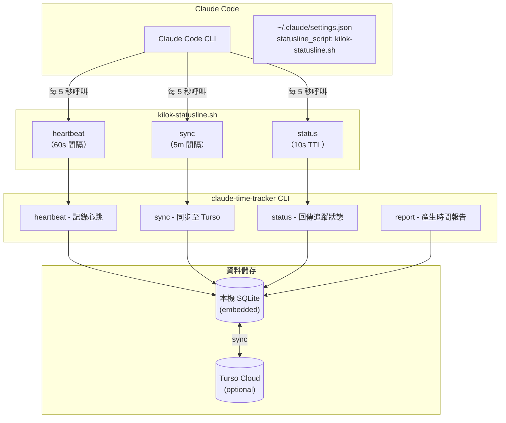

# Kilok - Claude Code Time Tracker

> **Kilok** 取自台語「記錄」（kì-lo̍k）的諧音，同時也是英文 **key log** 的組合。

## Project Overview

**Kilok** 是一個為 Claude Code 設計的時間追蹤工具，透過 statusline 整合自動記錄每個專案的工作時數。

### 核心特色

- **零侵入追蹤**：透過 Claude Code statusline hook 運作，無需任何手動操作
- **Work Item 追蹤**：自動從 git branch 提取 issue ID，聚合工作項目時間
- **Transcript 閒置偵測**：監控 Claude transcript 檔案的修改時間，精準判斷閒置狀態
- **雲端同步（可選）**：支援 Turso embedded replica，多裝置同步
- **MCP Server**：提供 Claude Code 內建工具，方便查詢和管理追蹤資料

---

## Directory Structure

```
.
├── apps/
│   └── web/              # SvelteKit 儀表板（開發中）
├── crates/
│   └── tracker/          # Rust CLI + MCP Server
│       └── src/
│           ├── main.rs       # CLI entry point
│           ├── mcp/          # MCP Server implementation
│           ├── tracker.rs    # Core tracking logic
│           ├── db.rs         # SQLite/Turso database
│           └── idle.rs       # Transcript-based idle detection
├── docs/
│   └── plans/            # 設計文件
├── scripts/
│   └── install.sh        # 安裝腳本
└── skill/
    └── SKILL.md          # Claude Code slash command 定義
```

---

## Technical Architecture



---

## Data Flow

### Heartbeat 流程

1. Claude Code statusline 每 5 秒呼叫 wrapper script
2. Wrapper script 節流：每 60 秒才實際呼叫 `heartbeat` 命令
3. `heartbeat` 命令：
   - 讀取 transcript JSONL 檔案的 mtime
   - 比較與上次 heartbeat 的時間差
   - 若 mtime 有變動 → 使用者活躍，累加時間
   - 若 mtime 超過 idle_timeout → 標記為閒置

### Idle Detection（閒置偵測）

```
Transcript JSONL 檔案位置：
~/.claude/projects/{hash}/{session-id}.jsonl

偵測邏輯：
┌─────────────────────────────────────────────┐
│ last_transcript_mtime vs current_mtime      │
├─────────────────────────────────────────────┤
│ mtime 有變化 → 使用者正在輸入/Claude 回應   │
│ mtime 無變化超過 10 分鐘 → 閒置             │
└─────────────────────────────────────────────┘
```

### 報告產生流程（關鍵）

使用者產生報告時，**必須透過 `/kilok` skill**，而非直接使用 CLI。

```
┌──────────────────────────────────────────────────────────────────┐
│ 使用者：「/kilok 幫我統計這個月的時數」                          │
└─────────────────────────────┬────────────────────────────────────┘
                              │
                              ▼
┌──────────────────────────────────────────────────────────────────┐
│ Step 1: 透過 MCP 取得原始資料                                    │
│         list_work_items(month: "2026-01")                        │
└─────────────────────────────┬────────────────────────────────────┘
                              │
                              ▼
┌──────────────────────────────────────────────────────────────────┐
│ Step 2: Claude 處理資料                                          │
│   • 翻譯 work item ID → 中文標題                                 │
│     (invoice-enhancements → 發票功能強化)                        │
│   • 彙整 git commits → 中文描述                                  │
└─────────────────────────────┬────────────────────────────────────┘
                              │
                              ▼
┌──────────────────────────────────────────────────────────────────┐
│ Step 3: 透過 MCP 儲存翻譯後的資料（關鍵！）                      │
│         create_work_item(identifier, title, description)         │
│                                                                  │
│   ⚠️ 這一步會將翻譯後的標題和描述存入資料庫                       │
│      Web 端才能讀取到可讀的中文內容                              │
└─────────────────────────────┬────────────────────────────────────┘
                              │
                              ▼
┌──────────────────────────────────────────────────────────────────┐
│ Step 4: 輸出格式化報告給使用者                                   │
└──────────────────────────────────────────────────────────────────┘
```

**為什麼不能只用 CLI？**

| 方式 | 原始資料 | 翻譯標題 | Web 儀表板 |
|------|----------|----------|------------|
| `/kilok` skill | ✅ | ✅ 自動翻譯並儲存 | ✅ 有資料 |
| CLI 直接執行 | ✅ | ❌ 只有技術 ID | ❌ 無翻譯資料 |

---

## Development Commands

```bash
# Build
cargo build -p claude-time-tracker

# Run CLI
cargo run -p claude-time-tracker -- status
cargo run -p claude-time-tracker -- report --format json

# Run MCP Server (for testing)
cargo run -p claude-time-tracker --bin claude-time-tracker-mcp

# Install to ~/.local/bin
./scripts/install.sh
```

---

## MCP Tools

| Tool | Description |
|------|-------------|
| `list_work_items` | 列出工作項目，支援日期和專案篩選 |
| `get_work_item` | 取得單一工作項目詳情 |
| `create_work_item` | 建立/更新工作項目（儲存翻譯標題） |
| `update_work_item` | 更新工作項目資料 |

---

## Configuration Files

### Global Config

`~/.config/claude-time-tracker/config.toml`

```toml
[settings]
idle_timeout_minutes = 10
database_path = "~/.local/share/claude-time-tracker/data.db"

[settings.turso]
url = "libsql://your-db.turso.io"
# auth_token 使用環境變數 TURSO_AUTH_TOKEN
```

### Project Config

`<project>/.claude-time-tracker.toml`

```toml
name = "專案顯示名稱"
work_item_pattern = "^(?:feature|fix|chore)/([A-Z]+-\\d+)"
```
