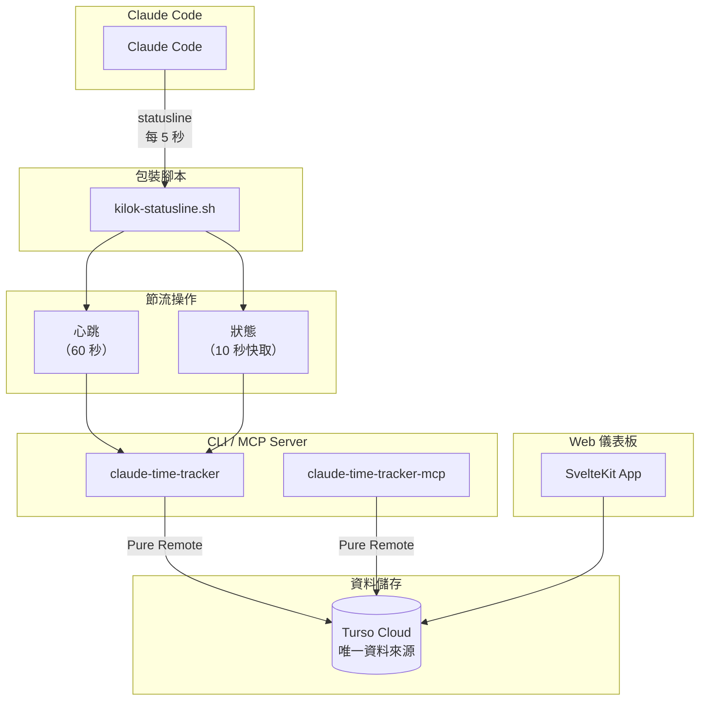

# Kilok

> **Kilok** 取自台語「記錄」（kì-lo̍k）的諧音，同時也是英文 **key log** 的組合——記錄你與 AI 協作的每一個關鍵時刻。

**Claude Code 自動時間追蹤工具** - 零手動操作，自動記錄你的 AI 輔助開發時間。

Kilok 透過 Claude Code 的 statusline 整合，自動記錄每個專案的工作時間，並依據 git branch 分組工作項目，從 branch 名稱提取 issue ID。

## 功能特色

- **零摩擦追蹤** - 透過 Claude Code statusline 運作，無需手動開始/停止
- **智慧閒置偵測** - 監控 Claude transcript 檔案變化，精準判斷閒置狀態
- **工作項目分組** - 自動從 git branch 提取 issue ID（支援 Linear、Jira、GitHub Issues）
- **計費工時計算** - 自動計算計費時數（原始時間 × 1.2，以 0.5h 為單位進位）
- **月額度追蹤** - 支援月結型合約，追蹤每月額度使用狀況與累計結轉
- **客戶分享連結** - 產生唯讀分享連結，讓客戶查看工時報告
- **多格式報告** - 匯出為 Markdown、CSV、TSV（Google Sheets）或 JSON
- **Turso 雲端資料庫** - 預設使用純遠端模式（Pure Remote），Turso 為唯一資料來源
- **MCP 整合** - 在 Claude Code 內直接查詢和管理追蹤資料
- **Web 儀表板** - 視覺化報告介面，支援客戶管理、合約設定、工作項目編輯

## 設定總覽

完整設定包含以下步驟：

| 步驟 | 項目 | 必要性 | 說明 |
|------|------|--------|------|
| 1 | [編譯安裝](#步驟-1編譯安裝) | 必要 | 編譯並安裝 CLI 和 MCP Server |
| 2 | [Statusline 設定](#步驟-2設定-statusline) | 必要 | 啟用自動時間追蹤 |
| 3 | [MCP Server 設定](#步驟-3設定-mcp-server) | 必要 | 讓 `/kilok` 指令可以存取資料 |
| 4 | [雲端同步（Turso）](#步驟-4雲端同步可選) | 可選 | 多裝置同步 |
| 5 | [Web 儀表板](#步驟-5web-儀表板可選) | 可選 | 視覺化報告介面（需要步驟 4） |

---

## 步驟 1：編譯安裝

### 前置需求

- Rust 工具鏈（cargo）
- Claude Code CLI

### 安裝

```bash
git clone https://github.com/user/kilok.git
cd kilok
./scripts/install.sh
```

安裝腳本會：
- 編譯 release 版本的執行檔
- 安裝到 `~/.local/bin/`
- 設定 `/kilok` 指令

確認 `~/.local/bin` 在你的 PATH 中：

```bash
# 加入 ~/.zshrc 或 ~/.bashrc
export PATH="$HOME/.local/bin:$PATH"
```

---

## 步驟 2：設定 Statusline

Statusline 是 Kilok 追蹤時間的核心機制。Claude Code 每 5 秒呼叫一次 statusline 腳本，Kilok 透過這個機制記錄工作時間。

> **⚠️ 注意**：Claude Code 只能設定一個 statusline 腳本。如果你已經有自己的 statusline 設定，這個步驟會**覆蓋**它。你可以將 Kilok 的心跳邏輯整合到現有的腳本中，參考 `scripts/statusline-example.sh` 的 `record_local_heartbeat` 函數。

### 2.1 複製 Statusline 腳本

```bash
cp scripts/statusline-example.sh ~/.local/bin/kilok-statusline.sh
chmod +x ~/.local/bin/kilok-statusline.sh
```

### Statusline 顯示內容

Kilok 提供 Powerlevel10k 風格的 statusline，使用圓角氣泡和 Nerd Font 圖示：

```
  專案目錄   main ✔   ⏱ 1h 23m   25°C ☁   Opus 4.5   ███░░ 45%   14:30:00
```

| 氣泡 | 說明 |
|------|------|
|  專案目錄 | 目前工作目錄（縮短顯示） |
|  main ✔ | Git branch + 狀態（✔ 乾淨, ✘ 有變更, ↑↓ 與遠端差異） |
| ⏱ 1h 23m | **Kilok 追蹤的活躍時間** |
| 25°C ☁ | 天氣資訊（需設定 API key，見下方） |
|  Opus 4.5 | 目前使用的 Claude 模型 |
| ███░░ 45% | Context window 使用量 |
| 14:30:00 | 目前時間 |

> **注意**：需要安裝 [Nerd Font](https://www.nerdfonts.com/) 才能正確顯示圖示。

### 天氣功能（可選）

天氣資訊使用台灣中央氣象署（CWA）API，需要申請 API key：

1. 前往 [CWA 開放資料平台](https://opendata.cwa.gov.tw/) 註冊帳號
2. 申請 API 授權碼
3. 在 `~/.config/claude-time-tracker/config.toml` 設定：

```toml
[settings.weather]
api_key = "your-cwa-api-key"
location = "北投區"        # 預設地區
cache_ttl_minutes = 60     # 快取時間（分鐘）
```

若未設定 API key，statusline 會自動隱藏天氣氣泡。

### 2.2 設定 Claude Code

編輯 `~/.claude/settings.json`：

```json
{
  "statusLine": {
    "type": "command",
    "command": "~/.local/bin/kilok-statusline.sh"
  }
}
```

### 驗證

重新啟動 Claude Code，你應該會在 statusline 看到追蹤狀態（⏱ 符號）。

---

## 步驟 3：設定 MCP Server

MCP Server 讓 `/kilok` 指令可以讀取和寫入追蹤資料。沒有設定 MCP Server，指令將無法運作。

編輯 `~/.mcp.json`：

```json
{
  "mcpServers": {
    "time-tracker": {
      "command": "~/.local/bin/claude-time-tracker-mcp"
    }
  }
}
```

### 驗證

在 Claude Code 中執行 `/mcp`，確認 `time-tracker` server 已連線。

---

## 步驟 4：設定 Turso 資料庫

Kilok 使用 Turso 作為唯一的資料來源（Pure Remote 模式）。本機不再保留獨立的 SQLite 資料庫，所有資料直接寫入 Turso 雲端。

> **⚠️ 重要**：若要使用 Web 儀表板或跨裝置同步，必須完成此步驟。

### 4.1 建立 Turso 資料庫

1. 前往 [turso.tech](https://turso.tech) 註冊帳號
2. 建立新的資料庫：

```bash
# 安裝 Turso CLI
brew install tursodatabase/tap/turso

# 登入
turso auth login

# 建立資料庫
turso db create kilok

# 取得連線資訊
turso db show kilok --url
turso db tokens create kilok
```

### 4.2 設定環境變數

將 token 加入你的 shell 設定檔（`~/.zshrc` 或 `~/.bashrc`）：

```bash
export TURSO_AUTH_TOKEN="your-token-here"
```

### 4.3 更新 MCP 設定

編輯 `~/.mcp.json`，加入環境變數：

```json
{
  "mcpServers": {
    "time-tracker": {
      "command": "~/.local/bin/claude-time-tracker-mcp",
      "env": {
        "TURSO_AUTH_TOKEN": "${TURSO_AUTH_TOKEN}"
      }
    }
  }
}
```

### 4.4 設定全域設定檔

編輯 `~/.config/claude-time-tracker/config.toml`：

```toml
[settings.turso]
url = "libsql://kilok-yourusername.turso.io"
```

### 驗證

```bash
claude-time-tracker sync
```

---

## 步驟 5：Web 儀表板（可選）

Web 儀表板提供視覺化的時間報告介面，方便與客戶或團隊分享。需要先完成步驟 4（Turso 雲端同步）。

### 5.1 安裝相依套件

```bash
cd apps/web
bun install
```

### 5.2 設定環境變數

複製範例設定檔：

```bash
cp .env.example .env
```

編輯 `.env`：

```bash
# Turso 資料庫連線（與步驟 4 相同）
TURSO_DATABASE_URL="libsql://kilok-yourusername.turso.io"
TURSO_AUTH_TOKEN="your-token-here"

# 管理員密碼（用於登入 /admin）
ADMIN_PASSWORD="your-admin-password"
```

### 5.3 啟動開發伺服器

```bash
bun dev
```

開啟瀏覽器前往 `http://localhost:5173`。

### 5.4 Web 儀表板功能

#### 管理介面（需登入）

| 路由 | 功能 |
|------|------|
| `/` | 工時總覽：所有客戶的本月/年度工時統計 |
| `/admin/clients` | 客戶管理：新增、編輯客戶資訊 |
| `/admin/projects` | 專案管理：設定專案顯示名稱、關聯客戶 |
| `/admin/contracts` | 合約管理：設定年度額度或月額度 |
| `/[clientSlug]` | 客戶詳情：年度統計、月度趨勢圖 |
| `/[clientSlug]/[period]` | 月報詳情：工作項目列表、計費工時編輯 |

#### 客戶分享頁面（無需登入）

每個客戶自動產生一組分享連結 token，可將唯讀報告分享給客戶：

| 路由 | 功能 |
|------|------|
| `/share/[token]` | 客戶年度總覽（唯讀） |
| `/share/[token]/[period]` | 客戶月報詳情（唯讀） |

在管理介面的客戶列表中，可點擊「複製分享連結」取得 URL。

#### 合約類型

| 類型 | 設定方式 | 說明 |
|------|----------|------|
| 年度額度 | 只設定 `total_hours` | 固定年度總額度 |
| 月額度 | 設定 `monthly_hours` | 每月額度，未用完可結轉（需設定 `carried_over`） |

#### 計費工時計算

系統自動計算計費工時：
- 公式：`原始時間 × 1.2`
- 進位單位：`0.5 小時`（例如 2.1h → 2.5h）
- 可在月報頁面手動覆寫計費工時

### 5.5 部署（可選）

Web 儀表板可以部署到任何支援 Node.js 的平台（Vercel、Cloudflare Pages、Fly.io 等）：

```bash
bun run build
```

---

## 設定完成！

完成以上步驟後，Kilok 會自動在背景追蹤你的 Claude Code 使用時間。

**下一步**：參考[產生報告](#產生報告)了解如何產生時間報告。

---

## 產生報告

建議透過 Claude Code 的 `/kilok` 指令產生時間報告。這個流程不只會產生報告，還會**將翻譯後的工作項目資料儲存到資料庫**，讓 Web 儀表板可以顯示。

### 運作方式

1. **呼叫指令**：在 Claude Code 中輸入

   ```
   /kilok 幫我統計這個月的時數
   ```

2. **Claude 處理資料**：
   - 透過 MCP 取得原始時間資料（`list_work_items`）
   - 將工作項目 ID 翻譯成可讀的標題（例如 `invoice-enhancements` → `發票功能強化`）
   - 彙整 git commit 訊息成簡潔的描述
   - **透過 MCP 儲存翻譯後的資料**（`create_work_item`）- 這會填入 Web 儀表板的內容

3. **收到格式化的報告**（繁體中文台灣用語）

### 為什麼要用指令？

| 方式 | 原始資料 | 翻譯標題 | Web 儀表板 |
|------|----------|----------|------------|
| `/kilok` 指令 | ✅ | ✅ 自動翻譯 | ✅ 資料已儲存 |
| 直接用 CLI | ✅ | ❌ 只有技術 ID | ❌ 無資料 |

指令會將技術性的 branch 名稱轉換成可讀的標題並存入資料庫，讓 Web 儀表板對非技術人員也有用。

### 範例提示

```
/kilok 幫我統計這個月的時數
/kilok 產生上個月的報告
/kilok 統計 Client-A 專案的工時
/kilok 輸出 Google Sheets 格式
```

---

## CLI 使用方式

### 檢視狀態

```bash
# 顯示目前追蹤狀態
claude-time-tracker status

# 簡短格式（給 statusline 用）
claude-time-tracker status --format short
```

### 產生報告

```bash
# 本月，Markdown 格式
claude-time-tracker report

# 指定月份
claude-time-tracker report --month 2025-01

# 篩選專案
claude-time-tracker report --project "my-project"

# TSV 格式（適合貼到 Google Sheets）
claude-time-tracker report --format tsv

# JSON 格式（程式處理用）
claude-time-tracker report --format json

# 所有格式輸出到資料夾
claude-time-tracker report --all-formats --output ~/reports/january
```

### 管理專案

```bash
# 列出所有追蹤的專案
claude-time-tracker projects list

# 設定專案顯示名稱
claude-time-tracker projects set-name /path/to/project "客戶 A - 電商專案"
```

### 設定

```bash
# 初始化全域設定
claude-time-tracker config init

# 用編輯器編輯設定
claude-time-tracker config edit

# 顯示目前設定
claude-time-tracker config show
```

## 專案設定

在專案根目錄建立 `.claude-time-tracker.toml`：

```toml
# 報告中顯示的名稱
name = "客戶 A - 電商專案"

# 從 branch 名稱提取工作項目 ID
# 範例：
#   Linear/Jira: "^(?:feature|fix|chore)/([A-Z]+-\\d+)"
#   GitHub Issues: "#(\\d+)"
work_item_pattern = "^(?:feature|fix|chore)/([A-Z]+-\\d+)"

[report]
include_commits = true
max_commits_per_item = 10
```

## 全域設定

`~/.config/claude-time-tracker/config.toml`：

```toml
[settings]
# 閒置超時時間（分鐘）
idle_timeout_minutes = 10

# 本機資料庫路徑
database_path = "~/.local/share/claude-time-tracker/data.db"

# 可選：Turso 雲端同步
[settings.turso]
url = "libsql://your-db.turso.io"
# 使用環境變數 TURSO_AUTH_TOKEN 設定驗證 token

[report]
default_format = "markdown"
include_commits = true
max_commits_per_item = 5
```

## 架構



> **Pure Remote 模式**：CLI、MCP Server、Web 儀表板都直接連接 Turso 雲端，不再使用本機 SQLite。這避免了多 process 併發寫入的問題。

### 閒置偵測

Kilok 監控 Claude transcript 檔案（`~/.claude/projects/{hash}/{session}.jsonl`）的修改時間：

- **活躍**：transcript 修改時間有變化 → 使用者正在輸入或 Claude 正在回應
- **閒置**：修改時間超過 `idle_timeout_minutes` 沒有變化 → 停止累計時間

這種方式比 hook 偵測更精準，因為它能捕捉實際的 Claude 活動。

## 授權

MIT
